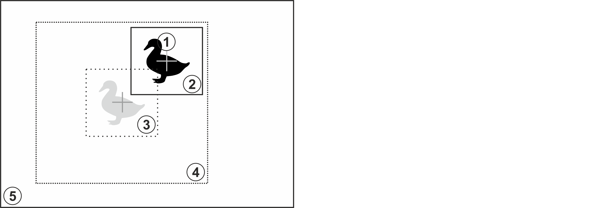
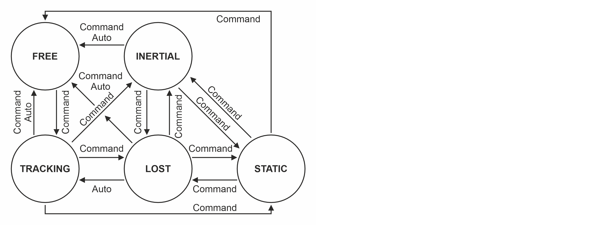

# **VTracker interface C++ library**

**v1.4.1**


# Table of contents

- [Overview](#Overview)
- [Versions](#Versions)
- [Library files](#Library-files)
- [Required operating principles](#Required-operating-principles)
- [VTracker interface class description](#VTracker-interface-class-description)
  - [VTracker class declaration](#VTracker-class-declaration)
  - [getVersion method](#getVersion-method)
  - [initVTracker method](#initVTracker-method)
  - [setParam method](#setParam-method)
  - [getParam method](#getParam-method)
  - [getParams method](#getParams-method)
  - [executeCommand method](#executeCommand-method)
  - [processFrame method](#processFrame-method)
  - [getImage method](#getImage-method)
  - [encodeSetParamCommand method](#encodeSetParamCommand-method)
  - [encodeCommand method](#encodeCommand-method)
  - [decodeCommand method](#decodeCommand-method)
  - [decodeAndExecuteCommand method](#decodeAndExecuteCommand-method)
- [Data structures](#Data-structures)
  - [VTrackerCommand enum](#VTrackerCommand-enum)
  - [VTrackerParam enum](#VTrackerParam-enum)
- [VTrackerParams class description](#VTrackerParams-class-description)
  - [VTrackerParams class declaration](#VTrackerParams-class-declaration)
  - [Serialize video tracker params](#Serialize-video-tracker-params)
  - [Deserialize video tracker params](#Deserialize-video-tracker-params)
  - [Read params from JSON file and write to JSON file](#Read-params-from-JSON-file-and-write-to-JSON-file)
- [Build and connect to your project](#Build-and-connect-to-your-project)
- [How to make custom implementation](#How-to-make-custom-implementation)


# Overview

**VTracker** C++ library provides standard interface as well defines data structures and rules for different video trackers. **VTracker** interface class doesn't do anything, just provides interface, defines data structures and provides methods to encode/decode commands and encode/decode params. Different video trackers inherit interface form **VTracker** C++ class. **VTracker.h** file contains list of data structures ([**VTrackerCommand enum**](#VTrackerCommand-enum), [**VTrackerParam enum**](#VTrackerParam-enum) and [**VTrackerParams class**](#VTrackerParams-class-description)) and **VTracker** class declaration. [**VTrackerParams class**](#VTrackerParams-class-description) contains video tracker params and includes methods to encode and decode params. [**VTrackerCommand enum**](#VTrackerCommand-enum) contains IDs of commands. [**VTrackerParam enum**](#VTrackerParam-enum) contains IDs of params. All video trackers should include params and commands listed in **VTracker.h** file. **VTracker** interface class depends on [**Frame**](https://github.com/ConstantRobotics-Ltd/Frame) class (describes video frame and video frame data structures, necessary for autofocus functions) and [**ConfigReader**](https://github.com/ConstantRobotics-Ltd/ConfigReader) library (provides methods to read/write JSON config files).


# Versions

**Table 1** - Library versions.

| Version | Release date | What's new                                                   |
| ------- | ------------ | ------------------------------------------------------------ |
| 1.0.0   | 20.07.2023   | First version.                                               |
| 1.1.0   | 10.08.2023   | - Data structures updated.                                   |
| 1.2.0   | 24.09.2023   | - Updated encode(...) and decode(...) methods of VTrackerParams.<br />- Added decodeAndExecuteCommand(...) method.<br />- Added example of video tracker implementation. |
| 1.3.0   | 26.09.2023   | - Signature of getParams(...) method changed.                |
| 1.3.1   | 13.11.2023   | - Frame class updated.                                       |
| 1.4.1   | 13.12.2023   | - Virtual destructor added.                                       |


# Library files

The **VTracker** library is a CMake project. Library files:

```xml
CMakeLists.txt ------------------- Main CMake file of the library.
3rdparty ------------------------- Folder with third-party libraries.
    CMakeLists.txt --------------- CMake file which includes third-party. libraries.
    ConfigReader ----------------- Source code of the ConfigReader library.
    Frame ------------------------ Source code of the Frame library.
example -------------------------- Folder with custom video tracker class.
    CMakeLists.txt --------------- CMake file for custom video tracker class.
    CustomVTracker.cpp ----------- Source code file of the CustomVTracker class.
    CustomVTracker.h ------------- Header with CustomVTracker class declaration.
    CustomVTrackerVersion.h ------ Header file which includes CustomVTracker version.
    CustomVTrackerVersion.h.in --- CMake service file to generate version file.
test ----------------------------- Folder with codec test application.
    CMakeLists.txt --------------- CMake file for codec test application.
    main.cpp --------------------- Source code file of VTracker class test application.
src ------------------------------ Folder with source code of the library.
    CMakeLists.txt --------------- CMake file of the library.
    VTracker.cpp ----------------- Source code file of the library.
    VTracker.h ------------------- Header file which includes VTracker class declaration.
    VTrackerVersion.h ------------ Header file which includes version of the library.
    VTrackerVersion.h.in --------- CMake service file to generate version file.
```


# Required operating principles

The video tracker shall provide the following principle of operation: each video frame without dropping must be send to the tracker for processing regardless of the current tracker operation mode. If the tracker is not in tracking mode, the tracker does not perform frame processing, but the processing function must be called by user. Tracker should calculate at least tracking rectangle position (aka object position) for each processed video frame. Figure 1 shows basic principles of object search on video frames.



**Figure 1** - Basic principles of object search. (**1** - object image on the current frame, **2** - tracking rectangle calculated after processing of the current frame, **3** - position of the tracking rectangle on the previous frame, **4** - object search window on the current frame relative to the position of the tracking rectangle on the previous frame, **5** - current video frame)

At the moment of object capturing, the rectangular area of the video frame (capture rectangle) specified in the capture parameters (position and size) is taken as the object reference image, on the basis of which the pattern is formed. The algorithm then searches an object in each frame of the video in particular search window. Search window is area bounded by the algorithm's parameters with the center coinciding with the calculated center of the tracking rectangle on the previous video frame (or the center of the capture rectangle if  the first frame after capture is being processed, position of search window can be change by user for any video frame). The calculated most probable position of the tracking object (with highest value of correlation function) in the current video frame (calculated center of the tracking rectangle) is taken as the coordinates of the object. Figure 1 shows a schematic representation of a video frame **(5)** that contains an image of a object **(1)**. Assume that on the previous video frame the object was in the area corresponding to area **(3)**, which is the area of the tracking rectangle (the most probable position of the object) in the previous video frame. The library performs object search in the area **(4)** whose center coincides with the position of the center of the tracking rectangle **(3)** in the previous video frame. Tracker should support (if it possible) follow modes.

**Table 2** - Tracking algorithm operating modes.

| Mode                                | Description                                                  |
| ----------------------------------- | ------------------------------------------------------------ |
| FREE - free mode.                   | In this mode, video tracker does not perform any calculations. Video tracker only adds video frames to the frame buffer. Conditions for entering FREE mode: **1.** Once the video tracker has been initialized. This mode is the default mode. **2.** Automatically when the automatic tracking reset criteria are met. **3.** After command RESET. |
| TRACKING - tracking mode.           | In this mode the video tracker calculates the automatic tracking and updates all calculated (estimated) object parameters. Criteria for entering TRACKING mode: **1.** After the CAPTURE command. **2.** Automatically from LOST mode when object detection criteria are met. |
| LOST - object loss  mode.           | In this mode, the video tracker searches object for automatic reсapturing (switching  to TRACKING mode) and updates it’s coordinates in one of the ways specified  in the parameters. LOST mode contains the following additional modes: **0.** Tracking rectangle coordinates are not updated (remain the same as  before entering LOST mode). **1.** The tracking rectangle coordinates are updated based on the components of the object's speed calculated before going into LOST mode. When the tracking rectangle reaches any edge of the frame, the coordinate update in the corresponding direction stops. **2.** The tracking rectangle coordinates are updated based on the components of the speed of objects in the video frames calculated before going into LOST mode. When the tracking reset criteria is met,  the device switches to FREE mode. Criteria for entering LOST mode: **1.** Automatically when object loss is detected. **2.** On command from TRACKING mode. 3. On command from INERTIAL mode. 4. On command from STATIC mode. |
| INERTIAL - inertial  tracking mode. | In this mode the video tracker does not search for an object to recapture automatically, but only updates the coordinates of the tracking rectangle based on the previously calculated velocity components of the objects. Criteria for entering INERTIAL mode: **1.** On command from TRACKING mode. **2.** On command from LOST mode. **3.** On command from STATIC mode. |
| STATIC - static  mode.              | This mode does not perform any calculations and the tracking rectangle coordinates remain the same as before going into this mode. This mode is  necessary to “freeze” the tracking algorithm for a certain number of frames. For example, if the tracking system is exposed to strong vibrations, it is possible to “freeze” the tracking algorithm until the vibration ends. |

Figure 2 shows the operating mode graph and the possible transitions between them. The words auto in figure 2 indicate the ability to change the mode automatically if the relevant criteria are met. the words command indicated the ability to change mode by user's command.



**Figure 2** - Operation modes of the tracking algorithm. (Auto – automatic mode change capability)

Figure 2 shows the graph of operation modes. There are the following conditions for automatic mode changes (word “Auto” in figure 2): **1.** Automatic switching from TRACKING to FREE mode is possible only if the tracking  rectangle center has touched (coincided in coordinates) any of the video frame edges. **2.** The automatic switching from TRACKING to LOST mode is possible when an object loss is detected – when the calculated object detection probability falls below the threshold. **3.** Automatic switching from LOST to TRACKING mode is possible when an object is detected again after a loss - when the calculated object detection probability exceeds the threshold. **4.** Automatic reset of tracking in the LOST mode (switch to FREE mode) is possible when the center of the tracking rectangle touches the edge of the video frame (if the LOST mode option set to 2), as well as when the number of frames specified in the parameters has  expired, at which the algorithm is continuously in LOST mode. **5.** Automatic reset of tracking in INERTIAL mode (switch to FREE mode) is possible when the  center of the tracking rectangle reaches the edge of the frame.


# VTracker interface class description


## VTracker class declaration

**VTracker** interface class declared in **VTracker.h** file. Class declaration:

```cpp
class VTracker
{
public:

    /// Class destructor.
    virtual ~VTracker();

    /// Get string of current library version.
    static std::string getVersion();

    /// Init video tracker.
    virtual bool initVTracker(VTrackerParams& params) = 0;

    /// Set video tracker param.
    virtual bool setParam(VTrackerParam id, float value) = 0;

    /// Get video tracker param value.
    virtual float getParam(VTrackerParam id) = 0;

    /// Get video tracker params (results).
    virtual void getParams(VTrackerParams& params) = 0;

    /// Execute command.
    virtual bool executeCommand(VTrackerCommand id,
                                float arg1 = 0,
                                float arg2 = 0,
                                float arg3 = 0) = 0;

    /// Process frame.
    virtual bool processFrame(cr::video::Frame& frame) = 0;

    ///  Get image of internal surfaces.
    virtual void getImage(int type, cr::video::Frame& image) = 0;

    /// Encode set param command.
    static void encodeSetParamCommand(
            uint8_t* data, int& size, VTrackerParam id, float value);

    /// Encode command.
    static void encodeCommand(
            uint8_t* data, int& size, VTrackerCommand id,
            float arg1 = 0, float arg2 = 0, float arg3 = 0);

    /// Decode command.
    static int decodeCommand(uint8_t* data,
                             int size,
                             VTrackerParam& paramId,
                             VTrackerCommand& commandId,
                             float& value1,
                             float& value2,
                             float& value3);

    /// Decode command.
    virtual bool decodeAndExecuteCommand(uint8_t* data, int size) = 0;
};
```


## getVersion method

**getVersion()** method returns string of current version of **VTracker** class. Particular video tracker class can have it's own **getVersion()** method. Method declaration:

```cpp
static std::string getVersion();
```

Method can be used without **VTracker** class instance:

```cpp
cout << "VTracker class version: " << VTracker::getVersion() << endl;
```

Console output:

```bash
VTracker class version: 1.4.1
```


## initVTracker method

**initVTracker(...)** method initializes video tracker by set of params. Method declaration:

```cpp
virtual bool initVTracker(VTrackerParams& params) = 0;
```

| Parameter | Value                                                        |
| --------- | ------------------------------------------------------------ |
| params    | Video tracker params class. Video tracker should initialize all parameters listed in [**VTrackerParams class**](#VTrackerParams-class-description). |

**Returns:** TRUE if the video tracker initialized or FALSE if not.


## setParam method

**setParam(...)** method sets new video tracker parameter value. The particular implementation of the video tracker must provide thread-safe **setParam(...)** method call. This means that the **setParam(...)** method can be safely called from any thread. Method declaration:

```cpp
virtual bool setParam(VTrackerParam id, float value) = 0;
```

| Parameter | Description                                                  |
| --------- | ------------------------------------------------------------ |
| id        | Parameter ID according to [**VTrackerParam enum**](#VTrackerParam-enum). |
| value     | Parameter value. Value depends on parameter ID.              |

**Returns:** TRUE if the parameter was set or FALSE if not.


## getParam method

**getParam(...)** method returns video tracker parameter value.  The particular implementation of the video tracker must provide thread-safe **getParam(...)** method call. This means that the **getParam(...)** method can be safely called from any thread. Method declaration:

```cpp
virtual float getParam(VTrackerParam id) = 0;
```

| Parameter | Description                                                  |
| --------- | ------------------------------------------------------------ |
| id        | Parameter ID according to [**VTrackerParam enum**](#VTrackerParam-enum). |

**Returns:** parameter value or -1 of the parameters doesn't exist in particular video tracker.


## getParams method

**getParams(...)** method returns video tracker params class and tracking results. The particular implementation of the video tracker must provide thread-safe **getParams(...)** method call. This means that the **getParams(...)** method can be safely called from any thread. Method declaration:

```cpp
virtual void getParams(VTrackerParams& params) = 0;
```

| Parameter | Description                                             |
| --------- | ------------------------------------------------------- |
| params    | Video tracker parameters class object (VTrackerParams). |


## executeCommand method

**executeCommand(...)** method executes video tracker command. The particular implementation of the video tracker must provide thread-safe **executeCommand(...)** method call. This means that the **executeCommand(...)** method can be safely called from any thread. Method declaration:

```cpp
virtual bool executeCommand(VTrackerCommand id, float arg1 = 0, float arg2 = 0, float arg3 = 0) = 0;
```

| Parameter | Description                                                  |
| --------- | ------------------------------------------------------------ |
| id        | Command ID according to [**VTrackerCommand enum**](#VTrackerCommand-enum). |
| arg1      | First argument. Value depends on command ID (see [**VTrackerCommand enum**](#VTrackerCommand-enum) description). |
| arg2      | Second argument. Value depends on command ID (see [**VTrackerCommand enum**](#VTrackerCommand-enum) description). |
| arg3      | Third argument. Value depends on command ID (see [**VTrackerCommand enum**](#VTrackerCommand-enum) description). |

**Returns:** TRUE is the command was executed or FALSE if not.


## processFrame method

**processFrame(...)** method processes video frame. Method declaration:

```cpp
virtual bool processFrame(cr::video::Frame& frame) = 0;
```

| Parameter | Description                                                  |
| --------- | ------------------------------------------------------------ |
| frame     | Video frame for processing. Video tracker processes only RAW pixel formats (BGR24, RGB24, GRAY, YUYV24, YUYV, UYVY, NV12, NV21, YV12, YU12, see [**Frame**](https://github.com/ConstantRobotics-Ltd/Frame) class description). |

**Returns:** TRUE is the video frame was processed FALSE if not. If video tracker not in tracking mode the method should return TRUE.


## getImage method

**getImage(...)** method designed to obtain images of internal matrixes. Depends on implementation. Method declaration:

```cpp
virtual void getImage(int type, cr::video::Frame& image) = 0;
```

| Parameter | Description                                                  |
| --------- | ------------------------------------------------------------ |
| type      | Image type. Depends on implementation.                       |
| frame     | Output frame (see [**Frame**](https://github.com/ConstantRobotics-Ltd/Frame) class description). Pixel format depends on implementation. |


## encodeSetParamCommand method

**encodeSetParamCommand(...)** static method designed to encode command to change any parameter for remote video tracker. To control video tracker remotely, the developer has to design his own protocol and according to it encode the command and deliver it over the communication channel. To simplify this, the **VTracker** class contains static methods for encoding the control command. The **VTracker** class provides two types of commands: a parameter change command (SET_PARAM) and an action command (COMMAND). **encodeSetParamCommand(...)** designed to encode SET_PARAM command. Method declaration:

```cpp
static void encodeSetParamCommand(uint8_t* data, int& size, VTrackerParam id, float value);
```

| Parameter | Description                                                  |
| --------- | ------------------------------------------------------------ |
| data      | Pointer to data buffer for encoded command. Must have size >= 11. |
| size      | Size of encoded data. Will be 11 bytes.                      |
| id        | Parameter ID according to [**VTrackerParam enum**](#VTrackerParam-enum). |
| value     | Parameter value. Value depends on parameter ID (see [**VTrackerParam enum**](#VTrackerParam-enum) description). |

**SET_PARAM** command format (11 bytes):

| Byte | Value | Description                                        |
| ---- | ----- | -------------------------------------------------- |
| 0    | 0x01  | SET_PARAM command header value.                    |
| 1    | 0x01  | Major version of VTracker class.                   |
| 2    | 0x03  | Minor version of VTracker class.                   |
| 3    | id    | Parameter ID **int32_t** in Little-endian format.  |
| 4    | id    | Parameter ID **int32_t** in Little-endian format.  |
| 5    | id    | Parameter ID **int32_t** in Little-endian format.  |
| 6    | id    | Parameter ID **int32_t** in Little-endian format.  |
| 7    | value | Parameter value **float** in Little-endian format. |
| 8    | value | Parameter value **float** in Little-endian format. |
| 9    | value | Parameter value **float** in Little-endian format. |
| 10   | value | Parameter value **float** in Little-endian format. |

**encodeSetParamCommand(...)** is static and used without **VTracker** class instance. This method used on client side (control system). Command encoding example:

```cpp
outValue = (float)(rand() % 20);
VTracker::encodeSetParamCommand(
data, size, VTrackerParam::MULTIPLE_THREADS, outValue);
```


## encodeCommand method

**encodeCommand(...)** static method designed to encode command for remote video tracker. To control video tracker remotely, the developer has to design his own protocol and according to it encode the command and deliver it over the communication channel. To simplify this, the **VTracker** class contains static methods for encoding the control command. The **VTracker** class provides two types of commands: a parameter change command (SET_PARAM) and an action command (COMMAND). **encodeCommand(...)** designed to encode COMMAND (action command). Method declaration:

```cpp
static void encodeCommand(uint8_t* data, int& size, VTrackerCommand id, float arg1 = 0, float arg2 = 0, float arg3 = 0);
```

| Parameter | Description                                                  |
| --------- | ------------------------------------------------------------ |
| data      | Pointer to data buffer for encoded command. Must have size >= 19. |
| size      | Size of encoded data. Will be 19 bytes.                      |
| id        | Command ID according to [**VTrackerCommand enum**](#VTrackerCommand-enum). |
| arg1      | First argument. Value depends on command ID (see [**VTrackerCommand enum**](#VTrackerCommand-enum) description). |
| arg2      | Second argument. Value depends on command ID (see [**VTrackerCommand enum**](#VTrackerCommand-enum) description). |
| arg3      | Third argument. Value depends on command ID (see [**VTrackerCommand enum**](#VTrackerCommand-enum) description). |

**COMMAND** format format (19 bytes):

| Byte | Value | Description                                                  |
| ---- | ----- | ------------------------------------------------------------ |
| 0    | 0x00  | COMMAND header value.                                        |
| 1    | 0x01  | Major version of VTracker class.                             |
| 2    | 0x03  | Minor version of VTracker class.                             |
| 3    | id    | Command ID **int32_t** in Little-endian format.              |
| 4    | id    | Command ID **int32_t** in Little-endian format.              |
| 5    | id    | Command ID **int32_t** in Little-endian format.              |
| 6    | id    | Command ID **int32_t** in Little-endian format.              |
| 7    | arg1  | First command argument value **float** in Little-endian format. |
| 8    | arg1  | First command argument value **float** in Little-endian format. |
| 9    | arg1  | First command argument value **float** in Little-endian format. |
| 10   | arg1  | First command argument value **float** in Little-endian format. |
| 11   | arg2  | Second command argument value **float** in Little-endian format. |
| 12   | arg2  | Second command argument value **float** in Little-endian format. |
| 13   | arg2  | Second command argument value **float** in Little-endian format. |
| 14   | arg2  | Second command argument value **float** in Little-endian format. |
| 15   | arg3  | Third command argument value **float** in Little-endian format. |
| 16   | arg3  | Third command argument value **float** in Little-endian format. |
| 17   | arg3  | Third command argument value **float** in Little-endian format. |
| 18   | arg3  | Third command argument value **float** in Little-endian format. |

**encodeCommand(...)** is static and used without **VTracker** class instance. This method used on client side (control system). Command encoding example:

```cpp
uint8_t data[1024];
int size = 0;
float outValue = (float)(rand() % 20);
float arg1 = (float)(rand() % 20);
float arg2 = (float)(rand() % 20);
float arg3 = (float)(rand() % 20);
VTracker::encodeCommand(data, size, VTrackerCommand::CAPTURE, arg1, arg2, arg3);
```


## decodeCommand method

**decodeCommand(...)** static method designed to decode command on video tracker side (edge device). Method declaration:

```cpp
static int decodeCommand(uint8_t* data, int size, VTrackerParam& paramId, VTrackerCommand& commandId, float& value1, float& value2, float& value3);
```

| Parameter | Description                                                  |
| --------- | ------------------------------------------------------------ |
| data      | Pointer to input command.                                    |
| size      | Size of command. Should be 11 bytes for SET_PARAM or 19 bytes for COMMAND. |
| paramId   | Parameter ID according to [**VTrackerParam enum**](#VTrackerParam-enum). After decoding SET_PARAM command the method will return parameter ID. |
| commandId | Command ID according to [**VTrackerCommand enum**](#VTrackerCommand-enum). After decoding COMMAND the method will return command ID. |
| value1    | Parameter value or first command argument 1. After decoding SET_PARAM and COMMAND. |
| value2    | Parameter value or second command argument 1. After decoding COMMAND. |
| value3    | Parameter value or third command argument 1. After decoding COMMAND. |

**Returns:** **0** - in case decoding COMMAND, **1** - in case decoding SET_PARAM command or **-1** in case errors.

**decodeCommand(...)** is static and used without **VTracker** class instance. Command decoding example:

```cpp
// Encode command.
uint8_t data[1024];
int size = 0;
float outValue = (float)(rand() % 20);
float arg1 = (float)(rand() % 20);
float arg2 = (float)(rand() % 20);
float arg3 = (float)(rand() % 20);
VTracker::encodeCommand(data, size, VTrackerCommand::CAPTURE, arg1, arg2, arg3);

// Decode command.
VTrackerCommand commandId;
VTrackerParam paramId;
float inArg1 = (float)(rand() % 20);
float inArg2 = (float)(rand() % 20);
float inArg3 = (float)(rand() % 20);
if (VTracker::decodeCommand(data, size, paramId, commandId, inArg1, inArg2, inArg3) != 0)
{
    cout << "Command not decoded" << endl;
    return false;
}
```


## decodeAndExecuteCommand method

**decodeAndExecuteCommand(...)** method decodes and executes command on video tracker side. The particular implementation of the video tracker must provide thread-safe **decodeAndExecuteCommand(...)** method call. This means that the **decodeAndExecuteCommand(...)** method can be safely called from any thread. Method declaration:

```cpp
virtual bool decodeAndExecuteCommand(uint8_t* data, int size) = 0;
```

| Parameter | Description                                                  |
| --------- | ------------------------------------------------------------ |
| data      | Pointer to input command.                                    |
| size      | Size of command. Must be 11 bytes for SET_PARAM or 19 bytes for COMMAND. |

**Returns:** TRUE if command decoded (SET_PARAM or COMMAND) and executed (action command or set param command).


# Data structures


## VTrackerCommand enum

**VTrackerCommand** enum describes commands supported by video tracker. **VTrackerCommand** enum declared in **VTracker.h** file. Enum declaration:

```cpp
enum class VTrackerCommand
{
    /// Object capture. Arguments:
    /// arg1 - Capture rectangle center X coordinate. -1 - default coordinate.
    /// arg2 - Capture rectangle center Y coordinate. -1 - default coordinate.
    /// arg3 - frame ID. -1 - Capture on last frame.
    CAPTURE = 1,
    /// Object capture command. Arguments:
    /// arg1 - Capture rectangle center X coordinate, percents of frame width.
    /// arg2 - Capture rectangle center Y coordinate, percents of frame width.
    CAPTURE_PERCENTS,
    /// Reset command. No arguments.
    RESET,
    /// Set INERTIAL mode. No arguments.
    SET_INERTIAL_MODE,
    /// Set LOST mode. No arguments.
    SET_LOST_MODE,
    /// Set STATIC mode. No arguments.
    SET_STATIC_MODE,
    /// Adjust tracking rectangle size automatically once. No arguments.
    ADJUST_RECT_SIZE,
    /// Adjust tracking rectangle position automatically once. No arguments.
    ADJUST_RECT_POSITION,
    /// Move tracking rectangle (change position). Arguments:
    /// arg1 - add to X coordinate, pixels. 0 - no change.
    /// arg2 - add to Y coordinate, pixels. 0 - no change.
    MOVE_RECT,
    /// Set tracking rectangle position in FREE mode. Arguments:
    /// arg1 - Rectangle center X coordinate.
    /// arg2 - Rectangle center Y coordinate.
    SET_RECT_POSITION,
    /// Set tracking rectangle position in FREE mode in percents of frame size.
    /// Arguments:
    /// arg1 - Rectangle center X coordinate, percents of frame width.
    /// arg2 - Rectangle center X coordinate, percents of frame height.
    SET_RECT_POSITION_PERCENTS,
    /// Move search window (change position). Arguments:
    /// arg1 - add to X coordinate, pixels. 0 - no change.
    /// arg2 - add to Y coordinate, pixels. 0 - no change.
    MOVE_SEARCH_WINDOW,
    /// Set search window position. Arguments:
    /// arg1 - Search window center X coordinate.
    /// arg2 - Search window center Y coordinate.
    SET_SEARCH_WINDOW_POSITION,
    /// Set search window position in percents of frame size. Arguments:
    /// arg1 - Search window center X coordinate, percents of frame width.
    /// arg2 - Search window center X coordinate, percents of frame height.
    SET_SEARCH_WINDOW_POSITION_PERCENTS,
    /// Change tracking rectangle size. Arguments:
    /// arg1 - horizontal size add, pixels.
    /// arg2 - vertical size add, pixels.
    CHANGE_RECT_SIZE
};
```

**Table 3** - Video tracker commands description. Some commands maybe unsupported by particular video tracker class. Necessary arguments for **executeCommand(...)** and **encodeCommand(...)** methods described.

| Command                             | Description                                                  |
| ----------------------------------- | ------------------------------------------------------------ |
| CAPTURE                             | Object capture. Arguments: arg1 - Capture rectangle center X coordinate. -1 - default coordinate, arg2 - Capture rectangle center Y coordinate. -1 - default coordinate, arg3 - frame ID. -1 - Capture on last frame. |
| CAPTURE_PERCENTS                    | Object capture command. Arguments: arg1 - Capture rectangle center X coordinate, percents of frame width, arg2 - Capture rectangle center Y coordinate, percents of frame width. |
| RESET                               | Reset command. No arguments.                                 |
| SET_INERTIAL_MODE                   | Set INERTIAL mode. No arguments.                             |
| SET_LOST_MODE                       | Set LOST mode. No arguments.                                 |
| SET_STATIC_MODE                     | Set STATIC mode. No arguments.                               |
| ADJUST_RECT_SIZE                    | Adjust tracking rectangle size automatically once. No arguments. |
| ADJUST_RECT_POSITION                | Adjust tracking rectangle position automatically once. No arguments. |
| MOVE_RECT                           | Move tracking rectangle (change position). Arguments: arg1 - add to X coordinate, pixels. 0 - no change, arg2 - add to Y coordinate, pixels. 0 - no change. |
| SET_RECT_POSITION                   | Set tracking rectangle position in FREE mode. Arguments: arg1 - Rectangle center X coordinate, arg2 - Rectangle center Y coordinate. |
| SET_RECT_POSITION_PERCENTS          | Set tracking rectangle position in FREE mode in percents of frame size. Arguments: arg1 - Rectangle center X coordinate, percents of frame width, arg2 - Rectangle center X coordinate, percents of frame height. |
| MOVE_SEARCH_WINDOW                  | Move search window (change position). Arguments: arg1 - add to X coordinate, pixels. 0 - no change, arg2 - add to Y coordinate, pixels. 0 - no change. |
| SET_SEARCH_WINDOW_POSITION          | Set search window position. Arguments: arg1 - Search window center X coordinate, arg2 - Search window center Y coordinate. |
| SET_SEARCH_WINDOW_POSITION_PERCENTS | Set search window position in percents of frame size. Arguments: arg1 - Search window center X coordinate, percents of frame width, arg2 - Search window center X coordinate, percents of frame height. |
| CHANGE_RECT_SIZE                    | Change tracking rectangle size. Arguments: arg1 - horizontal size add, pixels, arg2 - vertical size add, pixels. |


## VTrackerParam enum

**VTrackerParam** enum describes parameters supported by video tracker. **VTrackerParam** enum declared in **VTracker.h** file. Enum declaration:

```cpp
enum class VTrackerParam
{
    /// Width of search window, pixels. Set by user.
    SEARCH_WINDOW_WIDTH = 1,
    /// Height of search window, pixels. Set by user.
    SEARCH_WINDOW_HEIGHT,
    /// Tracking rectangle width, pixels. Set in user or can be changed by
    /// tracking algorithm if rectAutoSize == true.
    RECT_WIDTH,
    /// Tracking rectangle height, pixels. Set in user or can be changed by
    /// tracking algorithm if rectAutoSize == true.
    RECT_HEIGHT,
    /// Option for LOST mode. Parameter that defines the behavior of the
    /// tracking  algorithm in LOST mode. Default is 0. Possible values:
    /// 0. In LOST mode, the coordinates of the center of the  tracking
    ///    rectangle are not updated and remain the  same as before entering
    ///    LOST mode.
    /// 1. The coordinates of the center of the tracking  rectangle are updated
    ///    based on the components  of the object’s speed calculated before
    ///    going into  LOST mode. If the tracking rectangle “touches” the  edge
    ///    of the video frame, the coordinate updating  for this component
    ///    (horizontal or vertical) will stop.
    /// 2. The coordinates of the center of the tracking  rectangle are
    ///    updated based on the components  of the object’s speed calculated
    ///    before going into  LOST mode. The tracking is reset if the center of 
    ///    the tracking rectangle touches any of the edges of  the video frame.
    LOST_MODE_OPTION,
    /// Size of frame buffer (number of frames to store). Set by user.
    FRAME_BUFFER_SIZE,
    /// Maximum number of frames in LOST mode to auto reset of algorithm. Set
    /// by user.
    MAX_FRAMES_IN_LOST_MODE,
    /// Use tracking rectangle auto size flag: 0 - no use, 1 - use. Set by user.
    RECT_AUTO_SIZE,
    /// Use tracking rectangle auto position: 0 - no use, 1 - use. Set by user.
    RECT_AUTO_POSITION,
    /// Use multiple threads for calculations. 0 - one thread, 1 - multiple. Set
    /// by user.
    MULTIPLE_THREADS,
    /// Number of channels for processing. E.g., number of color channels. Set
    /// by user.
    NUM_CHANNELS,
    /// Tracker type. Depends on implementation. Set by user.
    TYPE,
    /// Custom parameter. Depends on implementation.
    CUSTOM_1,
    /// Custom parameter. Depends on implementation.
    CUSTOM_2,
    /// Custom parameter. Depends on implementation.
    CUSTOM_3
};
```

**Table 4** - Video tracker params description. Some params maybe unsupported by particular video tracker.

| Parameter               | Access       | Description                                                  |
| ----------------------- | ------------ | ------------------------------------------------------------ |
| SEARCH_WINDOW_WIDTH     | read / write | Width of search window, pixels. Set by user. (see **Required operating principles**). |
| SEARCH_WINDOW_HEIGHT    | read / write | Height of search window, pixels. Set by user. (see **Required operating principles**). |
| RECT_WIDTH              | read / write | Tracking rectangle width, pixels. (see **Required operating principles**). Set in user or can be changed by tracking algorithm if RECT_AUTO_SIZE == 1. |
| RECT_HEIGHT             | read / write | Tracking rectangle height, pixels (see **Required operating principles**). Set in user or can be changed by tracking algorithm if RECT_AUTO_SIZE == 1. |
| LOST_MODE_OPTION        | read / write | Option for LOST mode. Parameter that defines the behavior of the tracking  algorithm in LOST mode. Default is 0. Possible values:<br />**0.** In LOST mode, the coordinates of the center of the  tracking rectangle are not updated and remain the  same as before entering LOST mode.<br />**1.** The coordinates of the center of the tracking  rectangle are updated based on the components  of the object’s speed calculated before going into  LOST mode. If the tracking rectangle “touches” the  edge of the video frame, the coordinate updating  for this component (horizontal or vertical) will stop.<br />**2.** The coordinates of the center of the tracking  rectangle are updated based on the components  of the object’s speed calculated before going into  LOST mode. The tracking is reset if the center of  the tracking rectangle touches any of the edges of  the video frame. |
| FRAME_BUFFER_SIZE       | read / write | Size of frame buffer (number of frames to store). Set by user. |
| MAX_FRAMES_IN_LOST_MODE | read / write | Maximum number of frames in LOST mode to auto reset of algorithm. Set by user. |
| RECT_AUTO_SIZE          | read / write | Use tracking rectangle auto size flag: 0 - no use, 1 - use. Set by user. |
| RECT_AUTO_POSITION      | read / write | Use tracking rectangle auto position: 0 - no use, 1 - use. Set by user. |
| MULTIPLE_THREADS        | read / write | Use multiple threads for calculations. 0 - one thread, 1 - multiple. Set by user. |
| NUM_CHANNELS            | read / write | Number of channels for processing. E.g., number of color channels. Set by user. |
| TYPE                    | read / write | Tracker type. Depends on implementation. Set by user.        |
| CUSTOM_1                | read / write | Custom parameter. Depends on implementation.                 |
| CUSTOM_2                | read / write | Custom parameter. Depends on implementation.                 |
| CUSTOM_3                | read / write | Custom parameter. Depends on implementation.                 |


# VTrackerParams class description


## VTrackerParams class declaration

**VTrackerParams** class used for video tracker initialization (**initVTracker(...)** method) or to get all actual params and tracking results (**getParams()** method). Also **VTrackerParams** provide structure to write/read params from JSON files (**JSON_READABLE** macro, see [**ConfigReader**](https://github.com/ConstantRobotics-Ltd/ConfigReader) class description) and provides methos to encode and decode params. Class declaration:

```cpp
class VTrackerParams
{
public:
    /// Tracker mode index: 0 - FREE, 1 - TRACKING, 2 - INERTIAL, 3 - STATIC.
    /// Set by video tracker according to processing results or after command
    /// execution.
    int mode{0};
    /// Tracking rectangle horizontal center position. Calculated by tracking
    /// algorithm.
    int rectX{0};
    /// Tracking rectangle vertical center position. Calculated by tracking
    /// algorithm.
    int rectY{0};
    /// Tracking rectangle width, pixels. Set in user or can be changed by
    /// tracking algorithm if rectAutoSize == true.
    int rectWidth{72};
    /// Tracking rectangle height, pixels. Set in user or can be changed by
    /// tracking algorithm if rectAutoSize == true.
    int rectHeight{72};
    /// Estimated horizontal position of object center, pixels. Calculated by
    /// video tracker.
    int objectX{0};
    /// Estimated vertical position of object center, pixels.Calculated by
    /// video tracker.
    int objectY{0};
    /// Estimated object width, pixels. Calculated by video tracker.
    int objectWidth{72};
    /// Estimated object height, pixels. Calculated by video tracker.
    int objectHeight{72};
    /// Frame counter in LOST mode. After switching in LOST mode the video
    /// tracker start counting from 0. After switching to another mode from
    /// LOST mode the video tracker will reset this counter.
    int lostModeFrameCounter{0};
    /// Counter for processed frames after capture object. After reset tracking
    /// the video tracker will reset counter.
    int frameCounter{0};
    /// Width of processed video frame. Set by video tracker after processing
    /// first video frame.
    int frameWidth{0};
    /// Height of processed video frame. Set by video tracker after processing
    /// first video frame.
    int frameHeight{0};
    /// Width of search window, pixels. Set by user.
    int searchWindowWidth{256};
    /// Height of search window, pixels. Set by user.
    int searchWindowHeight{256};
    /// Horizontal position of search window center. This position will be used
    /// for next video frame. Usually it coincides with data tracking rectangle
    /// center but can be set by user to move search window for new video frame.
    int searchWindowX{0};
    /// Vertical position of search window center. This position will be used
    /// for next video frame. Usually it coinsides with data tracking rectangle
    /// center but can be set by user to move search window for new video frame.
    int searchWindowY{0};
    /// Option for LOST mode. Parameter that defines the behavior of the
    /// tracking  algorithm in LOST mode. Default is 0. Possible values:
    /// 0. In LOST mode, the coordinates of the center of the  tracking
    ///    rectangle are not updated and remain the  same as before entering
    ///    LOST mode.
    /// 1. The coordinates of the center of the tracking  rectangle are updated
    ///    based on the components  of the object’s speed calculated before
    ///    going into  LOST mode. If the tracking rectangle “touches” the  edge
    ///    of the video frame, the coordinate updating  for this component
    ///    (horizontal or vertical) will stop.
    /// 2. The coordinates of the center of the tracking  rectangle are
    ///    updated based on the components  of the object’s speed calculated
    ///    before going into  LOST mode. The tracking is reset if the center of 
    ///    the tracking rectangle touches any of the edges of  the video frame.
    int lostModeOption{0};
    /// Size of frame buffer (number of frames to store). Set by user.
    int frameBufferSize{128};
    /// Maximum number of frames in LOST mode to auto reset of algorithm. Set
    /// by user.
    int maxFramesInLostMode{128};
    /// ID of last processed frame in frame buffer. Set by video tracker.
    int processedFrameId{0};
    /// ID of last added frame to frame buffer. Set by video tracker.
    int frameId{0};
    /// Horizontal velocity of object on video frames (pixel/frame). Calculated
    /// by video tracker.
    float velX{0.0f};
    /// Vertical velocity of object on video frames (pixel/frame). Calculated
    /// by video tracker. 
    float velY{0.0f};
    /// Estimated probability of object detection. Calculated by video tracker.
    float detectionProbability{0.0f};
    /// Use tracking rectangle auto size flag: false - no use, true - use. Set
    /// by user.
    bool rectAutoSize{false};
    /// Use tracking rectangle auto position: false - no use, true - use. Set
    /// by user.
    bool rectAutoPosition{false};
    /// Use multiple threads for calculations. Set by user.
    bool multipleThreads{false};
    /// Number of channels for processing. E.g., number of color channels. Set
    /// by user.
    int numChannels{3};
    /// Tracker type. Depends on implementation. Set by user.
    int type{0};
    /// Processing time for last frame, mks. Calculated by video tracker.
    int processingTimeMks{0};
    /// Custom parameter. Depends on implementation.
    float custom1{0.0f};
    /// Custom parameter. Depends on implementation.
    float custom2{0.0f};
    /// Custom parameter. Depends on implementation.
    float custom3{0.0f};

    JSON_READABLE(VTrackerParams, rectWidth, rectHeight, searchWindowWidth,
                  searchWindowHeight, lostModeOption, frameBufferSize,
                  maxFramesInLostMode, rectAutoSize, rectAutoPosition,
                  multipleThreads, numChannels, type, custom1, custom2, custom3);

    /// operator =
    VTrackerParams& operator= (const VTrackerParams& src);

    /// Encode params.
    bool encode(uint8_t* data, int bufferSize,
                int& size, VTrackerParamsMask* mask = nullptr);

    /// Decode params.
    bool decode(uint8_t* data, int dataSize);
};
```

**Table 5** - VTrackerParams class fields description.

| Field                | Type  | Description                                                  |
| -------------------- | ----- | ------------------------------------------------------------ |
| mode                 | int   | Tracker mode index: 0 - FREE, 1 - TRACKING, 2 - INERTIAL, 3 - STATIC. Set by video tracker according to processing results or after command execution. |
| rectX                | int   | Tracking rectangle horizontal center position, pixels. Calculated by tracking algorithm. |
| rectY                | int   | Tracking rectangle vertical center position, pixels. Calculated by tracking algorithm. |
| rectWidth            | int   | Tracking rectangle width, pixels. Set in user or can be changed by tracking algorithm if rectAutoSize == true. |
| rectHeight           | int   | Tracking rectangle height, pixels. Set in user or can be changed by tracking algorithm if rectAutoSize == true. |
| objectX              | int   | Estimated horizontal position of object center, pixels. Calculated by video tracker. |
| objectY              | int   | Estimated vertical position of object center, pixels. Calculated by video tracker. |
| objectWidth          | int   | Estimated object width, pixels. Calculated by video tracker. |
| objectHeight         | int   | Estimated object height, pixels. Calculated by video tracker. |
| lostModeFrameCounter | int   | Frame counter in LOST mode. After switching in LOST mode the video tracker start counting from 0. After switching to another mode from LOST mode the video tracker will reset this counter. |
| frameCounter         | int   | Counter for processed frames after capture object. After reset tracking the video tracker will reset counter. |
| frameWidth           | int   | Width of processed video frame. Set by video tracker after processing first video frame. |
| frameHeight          | int   | Height of processed video frame. Set by video tracker after processing first video frame. |
| searchWindowWidth    | int   | Width of search window, pixels. Set by user.                 |
| searchWindowHeight   | int   | Height of search window, pixels. Set by user.                |
| searchWindowX        | int   | Horizontal position of search window center. This position will be used for next video frame. Usually it coincides with data tracking rectangle center but can be set by user to move search window for new video frame. |
| searchWindowY        | int   | Vertical position of search window center. This position will be used for next video frame. Usually it coincides with data tracking rectangle center but can be set by user to move search window for new video frame. |
| lostModeOption       | int   | Option for LOST mode. Parameter that defines the behavior of the tracking  algorithm in LOST mode. Default is 0. Possible values:<br/>**0.** In LOST mode, the coordinates of the center of the  tracking rectangle are not updated and remain the  same as before entering LOST mode.<br/>**1.** The coordinates of the center of the tracking  rectangle are updated based on the components  of the object’s speed calculated before going into  LOST mode. If the tracking rectangle “touches” the  edge of the video frame, the coordinate updating  for this component (horizontal or vertical) will stop.<br />**2.** The coordinates of the center of the tracking  rectangle are updated based on the components  of the object’s speed calculated before going into  LOST mode. The tracking is reset if the center of the tracking rectangle touches any of the edges of  the video frame. |
| frameBufferSize      | int   | Size of frame buffer (number of frames to store). Set by user. |
| maxFramesInLostMode  | int   | Maximum number of frames in LOST mode to auto reset of algorithm. Set by user. |
| processedFrameId     | int   | ID of last processed frame in frame buffer. Set by video tracker. |
| frameId              | int   | ID of last added frame to frame buffer. Set by video tracker. |
| velX                 | float | Horizontal velocity of object on video frames (pixel/frame). Calculated by video tracker. |
| velY                 | float | Vertical velocity of object on video frames (pixel/frame). Calculated by video tracker. |
| detectionProbability | float | Estimated probability of object detection. Calculated by video tracker. |
| rectAutoSize         | bool  | Use tracking rectangle auto size flag: false - no use, true - use. Set by user. |
| rectAutoPosition     | bool  | Use tracking rectangle auto position: false - no use, true - use. Set by user. |
| multipleThreads      | bool  | Use multiple threads for calculations. Set by user.          |
| numChannels          | int   | Number of channels for processing. E.g., number of color channels. Set by user. |
| type                 | int   | Tracker type. Depends on implementation. Set by user.        |
| processingTimeMks    | int   | Processing time for last frame, mks. Calculated by video tracker. |
| custom1              | float | Custom parameter. Depends on implementation.                 |
| custom2              | float | Custom parameter. Depends on implementation.                 |
| custom3              | float | Custom parameter. Depends on implementation.                 |


## Serialize video tracker params

**VTrackerParams** class provides method **encode(...)** to serialize video tracker params (fields of VTrackerParams class, see Table 5). Serialization of params necessary in case when you need to send params via communication channels. Method provides options to exclude particular parameters from serialization. To do this method inserts binary mask (5 bytes) where each bit represents particular parameter and **decode(...)** method recognizes it. Method doesn't encode initString. Method declaration:

```cpp
bool encode(uint8_t* data, int bufferSize, int& size, VTrackerParamsMask* mask = nullptr);
```

| Parameter  | Value                                                        |
| ---------- | ------------------------------------------------------------ |
| data       | Pointer to data buffer. Buffer size should be at least **135** bytes. |
| bufferSize | Data buffer size. Buffer size should be at least **135** bytes. |
| size       | Size of encoded data.                                        |
| mask       | Parameters mask - pointer to **VrackerParamsMask** structure. **VTrackerParamsMask** (declared in VTracker.h file) determines flags for each field (parameter) declared in [**VTrackerParams class**](#VTrackerParams-class-description). If the user wants to exclude any parameters from serialization, he can put a pointer to the mask. If the user wants to exclude a particular parameter from serialization, he should set the corresponding flag in the **VTrackerParamsMask** structure. |

**VTrackerParamsMask** structure declaration:

```cpp
typedef struct VTrackerParamsMask
{
    bool mode{true};
    bool rectX{true};
    bool rectY{true};
    bool rectWidth{true};
    bool rectHeight{true};
    bool objectX{true};
    bool objectY{true};
    bool objectWidth{true};
    bool objectHeight{true};
    bool lostModeFrameCounter{true};
    bool frameCounter{true};
    bool frameWidth{true};
    bool frameHeight{true};
    bool searchWindowWidth{true};
    bool searchWindowHeight{true};
    bool searchWindowX{true};
    bool searchWindowY{true};
    bool lostModeOption{true};
    bool frameBufferSize{true};
    bool maxFramesInLostMode{true};
    bool processedFrameId{true};
    bool frameId{true};
    bool velX{true};
    bool velY{true};
    bool detectionProbability{true};
    bool rectAutoSize{true};
    bool rectAutoPosition{true};
    bool multipleThreads{true};
    bool numChannels{true};
    bool type{true};
    bool processingTimeMks{true};
    bool custom1{true};
    bool custom2{true};
    bool custom3{true};
} VTrackerParamsMask;
```

Example without parameters mask:

```cpp
// Prepare random params.
VTrackerParams in;
in.mode = rand() % 255;
in.rectX = rand() % 255;
in.rectY = rand() % 255;

// Encode data.
uint8_t data[1024];
int size = 0;
in.encode(data, 1024, size);
cout << "Encoded data size: " << size << " bytes" << endl;
```

Example with parameters mask:

```cpp
// Prepare random params.
VTrackerParams in;
in.mode = rand() % 255;
in.rectX = rand() % 255;
in.rectY = rand() % 255;

// Prepare mask.
VTrackerParamsMask mask;
mask.mode = true;
mask.rectX = false;
mask.rectY = true;

// Encode data.
uint8_t data[1024];
int size = 0;
in.encode(data, 1024, size, &mask);
cout << "Encoded data size: " << size << " bytes" << endl;
```


## Deserialize video tracker params

[**VTrackerParams class**](#VTrackerParams-class-description) provides method **decode(...)** to deserialize params (fields of VTrackerParams class, see Table 5). Deserialization of params necessary in case when you need to receive params via communication channels. Method automatically recognizes which parameters were serialized by **encode(...)** method. Method declaration:

```cpp
bool decode(uint8_t* data, int dataSize);
```

| Parameter | Value                          |
| --------- | ------------------------------ |
| data      | Pointer to encode data buffer. |

**Returns:** TRUE if data decoded (deserialized) or FALSE if not.

Example:

```cpp
// Prepare random params.
VTrackerParams in;
in.mode = rand() % 255;
in.rectX = rand() % 255;
in.rectY = rand() % 255;

// Encode data.
uint8_t data[1024];
int size = 0;
in.encode(data, 1024, size);
cout << "Encoded data size: " << size << " bytes" << endl;

// Decode data.
VTrackerParams out;
if (!out.decode(data, size))
{
    cout << "Can't decode data" << endl;
    return false;
}
```


## Read params from JSON file and write to JSON file

**VTracker** library depends on **ConfigReader** library which provides method to read params from JSON file and to write params to JSON file. Example of writing and reading params to JSON file:

```cpp
// Prepare random params.
VTrackerParams in;
in.mode = rand() % 255;
in.rectX = rand() % 255;
in.rectY = rand() % 255;

// Write params to file.
cr::utils::ConfigReader inConfig;
inConfig.set(in, "VTrackerParams");
inConfig.writeToFile("VTrackerParams.json");

// Read params from file.
cr::utils::ConfigReader outConfig;
if(!outConfig.readFromFile("VTrackerParams.json"))
{
    cout << "Can't open config file" << endl;
    return false;
}

// Obtain params from config reader.
VTrackerParams out;
if(!outConfig.get(out, "VTrackerParams"))
{
    cout << "Can't read params from file" << endl;
    return false;
}
```

**VTrackerParams.json** will look like:

```json
{
    "VTrackerParams": {
        "custom1": 155.0,
        "custom2": 239.0,
        "custom3": 79.0,
        "frameBufferSize": 130,
        "lostModeOption": 65,
        "maxFramesInLostMode": 111,
        "multipleThreads": true,
        "numChannels": 47,
        "rectAutoPosition": true,
        "rectAutoSize": true,
        "rectHeight": 18,
        "rectWidth": 2,
        "searchWindowHeight": 19,
        "searchWindowWidth": 195,
        "type": 213
    }
}
```


# Build and connect to your project

Typical commands to build **VTracker** library:

```bash
git clone https://github.com/ConstantRobotics-Ltd/VTracker.git
cd VTracker
git submodule update --init --recursive
mkdir build
cd build
cmake ..
make
```

If you want connect **VTracker** library to your CMake project as source code you can make follow. For example, if your repository has structure:

```bash
CMakeLists.txt
src
    CMakeList.txt
    yourLib.h
    yourLib.cpp
```

You can add repository **VTracker** as submodule by commands:

```bash
cd <your respository folder>
git submodule add https://github.com/ConstantRobotics-Ltd/VTracker.git 3rdparty/VTracker
git submodule update --init --recursive
```

In you repository folder will be created folder **3rdparty/VTracker** which contains files of **VTracker** repository with subrepositories **Frame** and **ConfigReader**. New structure of your repository:

```bash
CMakeLists.txt
src
    CMakeList.txt
    yourLib.h
    yourLib.cpp
3rdparty
    VTracker
```

Create CMakeLists.txt file in **3rdparty** folder. CMakeLists.txt should contain:

```cmake
cmake_minimum_required(VERSION 3.13)

################################################################################
## 3RD-PARTY
## dependencies for the project
################################################################################
project(3rdparty LANGUAGES CXX)

################################################################################
## SETTINGS
## basic 3rd-party settings before use
################################################################################
# To inherit the top-level architecture when the project is used as a submodule.
SET(PARENT ${PARENT}_YOUR_PROJECT_3RDPARTY)
# Disable self-overwriting of parameters inside included subdirectories.
SET(${PARENT}_SUBMODULE_CACHE_OVERWRITE OFF CACHE BOOL "" FORCE)

################################################################################
## CONFIGURATION
## 3rd-party submodules configuration
################################################################################
SET(${PARENT}_SUBMODULE_VTRACKER                        ON  CACHE BOOL "" FORCE)
if (${PARENT}_SUBMODULE_VTRACKER)
    SET(${PARENT}_VTRACKER                              ON  CACHE BOOL "" FORCE)
    SET(${PARENT}_VTRACKER_TEST                         OFF CACHE BOOL "" FORCE)
    SET(${PARENT}_VTRACKER_EXAMPLE                      OFF CACHE BOOL "" FORCE)
endif()

################################################################################
## INCLUDING SUBDIRECTORIES
## Adding subdirectories according to the 3rd-party configuration
################################################################################
if (${PARENT}_SUBMODULE_VTRACKER)
    add_subdirectory(VTracker)
endif()
```

File **3rdparty/CMakeLists.txt** adds folder **VTracker** to your project and excludes test application (VTracker class test applications) from compiling. Your repository new structure will be:

```bash
CMakeLists.txt
src
    CMakeList.txt
    yourLib.h
    yourLib.cpp
3rdparty
    CMakeLists.txt
    VTracker
```

Next you need include folder 3rdparty in main **CMakeLists.txt** file of your repository. Add string at the end of your main **CMakeLists.txt**:

```cmake
add_subdirectory(3rdparty)
```

Next you have to include VTracker library in your **src/CMakeLists.txt** file:

```cmake
target_link_libraries(${PROJECT_NAME} VTracker)
```

Done!


# How to make custom implementation

The **VTracker** class provides only an interface, data structures, and methods for encoding and decoding commands and params. To create your own implementation of the video tracker, you must include the VTracker repository in your project (see [**Build and connect to your project**](#Build-and-connect-to-your-project) section). The catalogue **example** (see [**Library files**](#Library-files) section) includes an example of the design of the custom video tracker. You must implement all the methods of the VTracker interface class. Custom video tracker class declaration:

```cpp
class CustomVTracker: public VTracker
{
public:

    /// Class constructor.
    CustomVTracker();

    /// Class destructor.
    ~CustomVTracker();

    /// Get string of current library version.
    static std::string getVersion();

    /// Init video tracker.
    bool initVTracker(VTrackerParams& params);

    /// Set video tracker param.
    bool setParam(VTrackerParam id, float value);

    /// Get video tracker param value.
    float getParam(VTrackerParam id);

    /// Get video tracker params (results).
    void getParams(VTrackerParams& params);

    /// Execute command.
    bool executeCommand(VTrackerCommand id,
                                float arg1 = 0,
                                float arg2 = 0,
                                float arg3 = 0);

    /// Process frame.
    bool processFrame(cr::video::Frame& frame);

    /// Get image of internal surfaces.
    void getImage(int type, cr::video::Frame& image);

public:

    /// Video tracker params (default params).
    VTrackerParams m_params;
};
```

